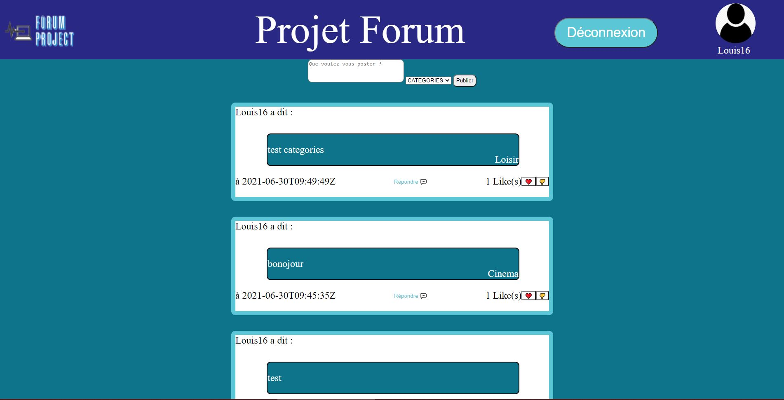
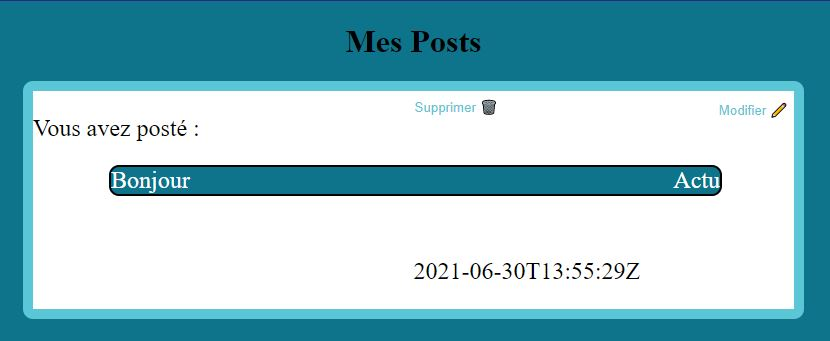

# Forum-Project

## Présentation
***
Ce projet consiste a réaliser un site web de type **Forum** où il nous devait être possible de créer des **posts** que ce soit des images ou des textes. Nous devions avoir la possibilités de d'ajouter une ou plusieurs catégories (pré-déterminées). Avoir un système de réaction au posts, likes ou commentaires.
Pour pouvoir participer au ajouts de posts et réaction nous devions gérer un système d'authentification. 

Ce projet a été réalisé en GO, JS et HTML/CSS.
Dans ce projet nous sommes quatre, Tao BOURMAUD, Antoine BOUFFARD, Arnaud CLAVIER et Louis TEILLIAIS.   

***
## Fonctionnement

Pour lancer notre site web, il suffit de se rendre dans notre dossier **Forum-Poject** sur un éditeur de code comme Visual Studio Code par exemple, puis de lancer dans la console la commande go run server.go puis de se rendre sur un navigateur et l'aller à l'url localhost:8000. On tombe sur la page d'Accueil du site, on peut ansi changer de page en cliquant sur les boutons de notre header.

* ⚠️ Il vous faudra peut être rentrer au préalable la commande ***go get github.com/google/uuid*** dans le terminale au risque d'une erreur car le code ne trouvera pas cette import ⚠️. 

Sur la page **home** on va retrouver tout les posts de tout les utilisateurs avec leurs nombres de likes et les commentaires comme un sorte de fil d'actualité on pourra y écrire des posts un fois que l'utilisateurs sera connecté. 

Sur la page du **profil** on va retrouver le "pseudo" de l'utilisateurs ainsi que des boutons qui sont des liens vers les pages **userPosts** et **userLikes**. 

La page **UserPosts** nous sert à afficher tout les posts crées par un utilisateur avec des options pour le modifier ou encore le supprimer définitivement. 

Idem pour la page **UserLikes** qui nous sert a afficher tout les posts liker par l'utilisateurs en question par contre il ne peut pas intéragir avec. 

Nous avons aussi deux autre pages de **Connexion** et d'**Inscritpion**.

***
## Organisation du code

Nous avons organisé notre code de façon a mettre tout les fichiers de mêmes langages dans les mêmes dossier :

- Un dossier **template** où nous avons tous nos fichier HTML, entre autres **Accueil.html**, **connexion.html**, **inscription.html**,**profil.html**, etc.. Dans ce dossier, nous avons aussi notre fichier header.html qui se trouve sur toutes nos pages.

- Un dossier **static** où se trouve plusieurs dossiers css, images et scripts. Le fichier css contient tous nos fichiers pour le style des pages, ex : **Accueil.css**, **profil.css**, **connexion.css**, etc.... Le dossier images, comme son nom l'indique contient juste l'image que l'on a besoin. Le dossier scripts contient lui les fichier JS que l'on utilise pour nos pages : **accueil.js**, **Header.js**, **userPosts.js**.

- Un dossier **src**, qui lui contient les fichiers qui vont nous permettre de gérer les fonctionnalités de nos différentes pages, en GO : **connexion.go**, **cookies.go**, **Profil.go**, etc... 

- Pour finir, un dossier **bdd** qui va contenir la base de données, ainsi que tout les fichier dont on a besoin pour l'utiliser : **getBDD.go**, **Poste_BDD.go**, **Session_BDD.go**, etc ...

Nous avons aussi a la racine notre serveur en GO qui nous permet de lancer notre site, il se nomme server.go
***

**OUTILS** :

[Ytrack](https://ytrack.learn.ynov.com/intra/nantes/modules-nantes/forum)

[Trello](https://trello.com/b/Uw8svgzO/projet-forum)

[Github](https://github.com/01-edu/public/tree/master/subjects/forum#instructions)

[Figma](https://www.figma.com/file/0csD7xKr5pK5YF2pLch8pM/Untitled?node-id=0%3A1)

[Miro](https://miro.com/welcomeonboard/etZgF6OuEeGWBk7fbvOViFWdDMl9rTU5tBCBydfEG19BL5MpuDGSctqfzjiOF0Mz)

[Documentation](https://docs.google.com/document/d/18iLWEdNrKuij4L-j_bLBICJS9fo8Jg1Q8BcIHB42WVg/edit?usp=sharing)